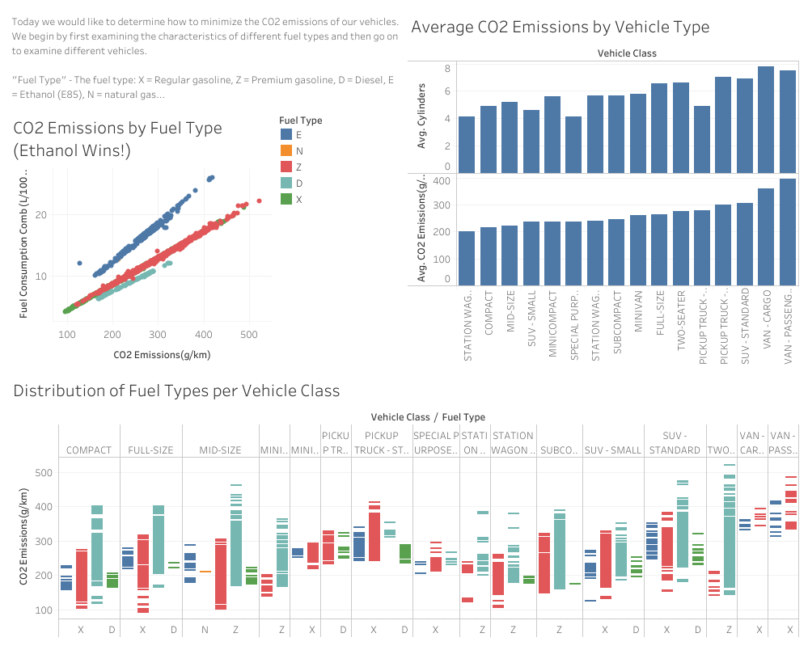

# CO2_Emissions
Tableau visualizations are used to generate a dashboard for quick consumption.
Essentially, this is a shorthand version of a report I made in Python, that is now available in Tableau.

For the interactive version of the Tableau Dashboard, come see this Tableau Public url.
Alternatively, there is a pdf version provided that may be opened instead.
If the original data and Python scripts are desired, see the src folder.

https://public.tableau.com/views/CO2EmissionsbyVehicleClassandFuel/Dashboard1?:language=en-US&:display_count=n&:origin=viz_share_link

